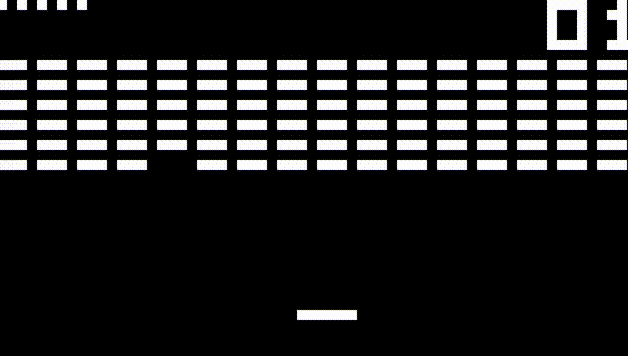

# Chip8D

CHIP-8 emulator written in C using SDL2 library. Frequency of fetch-execute cycles and delay/sound timers is 500hz and 60hz respectively. No sound implemented.

Includes a simple debugger, which shows register values, memory contents, input states and recent instructions.


## Screenshots




## Requirements

- sdl2
- sdl2_image
- sdl2_ttf


## Building
Clone the project
```bash
  git clone https://github.com/blr-ophon/chip8D
```
Compile and install using:

```bash
  make
  sudo make install
```
Uninstall with:

```bash
  sudo make uninstall
```
## Running

Provide any CHIP-8 rom.  (Super CHIP-48 ones not supported)

```bash
  chip8D /path/to/ROM
```


## Usage

CHIP-8 keyboard 0 to F keys are binded to their QWERTY literal counterpart.

Use `esc` to quit and `tab` to enter/exit debug mode

In debug mode, use left and right arrow keys to navigate between memory pages and space to 
execute current instruction.
